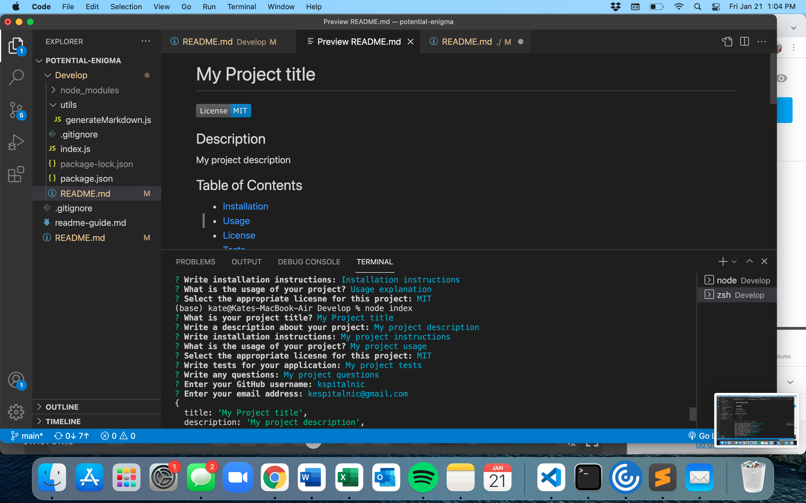

# ReadMe-Generator

This application generates a README.md file by accepting user inputs from the command line. 

## Installation and Usage 

To use this application, it is necessary to clone the repository, cd into the folder with the index ("Develop" folder).js, and enter "node index" into the command line. Then, the user can respond to the prompts. Once the command line reports "Success!", the user can open 'README.MD' which can be found where the index.js file is located. 

Example: https://watch.screencastify.com/v/atlLBxYifjMLnbg9yK31 

## Strategies Used 
* Node 
* NPM - inquire 
* JavaScript
* Arrow functions, fs, requrie packages, arrays

 
  ## GitHub 
  Link to Repo: https://github.com/kspitalnic/readme-generator

   

  Screenshot: 
